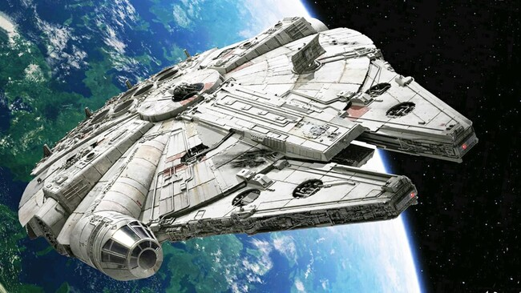

# Mi primer Markdown

## ¿Qué puede hacer?:

Markdown es un lenguaje de marcado ligero que se utiliza para dar  formato y estructura a documentos de texto de una manera sencilla y  legible. Puede escribir **palabras en negrita**, *palabras en cursiva*, o código como esto: 

`document.write('Hola mundo')`

## Ejemplo de código

`<!DOCTYPE html>`

`<html>`

`<head>`

​	`<title>Hola mundo>`	

`</head>`

`<body>`

​	`<h1>Hola mundo</h1>`

`</body>`

`</html>` 

## Listas:
### Ordenada:
1. Primero
2. Segundo
3. Tercero
4. Cuarto

### Desordenada:
- Feo, fuerte y formal -- Loquillo
- La vereda de la puerta de atrás -- Extremoduro
- La costa del silencio -- Mago de Oz
- No hay tregua -- Barricada

## Enlaces:
URL externa: [Cintas de cassette](https://universalmusiconline.es/collections/cassette)

Fichero Markdown del repo: [Fchero 2](fichero2.md)

## Imágen y tabla
### Imágen:

### Tabla:
| Juego | Año | Consola |
|---|---|---|
| The Legend of Zelda: Ocarina of Time | 1998 | Nintendo 64 |
| The Legend of Zelda: Majora's Mask | 2000 | Nintendo 64 |
| The Legend of Zelda: Twilight Princess | 2006 | GameCube / Wii |
| The Legend of Zelda: Breath of the Wild | 2017 | Wii U / Switch |
| The Legend of Zelda: Tears of the Kingdom | 2023 | Nintendo Switch |